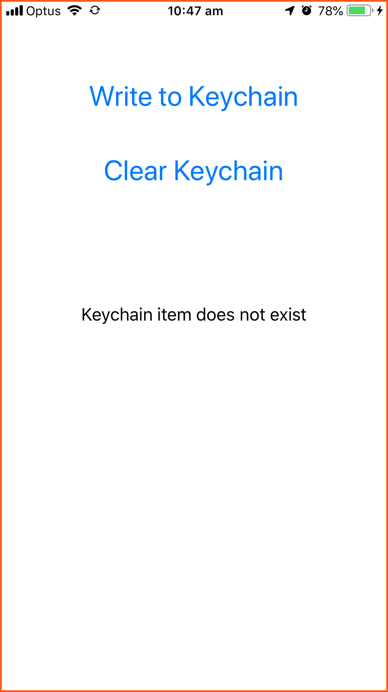
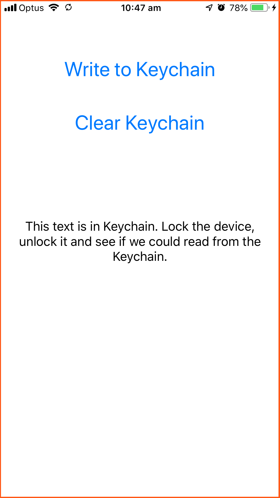
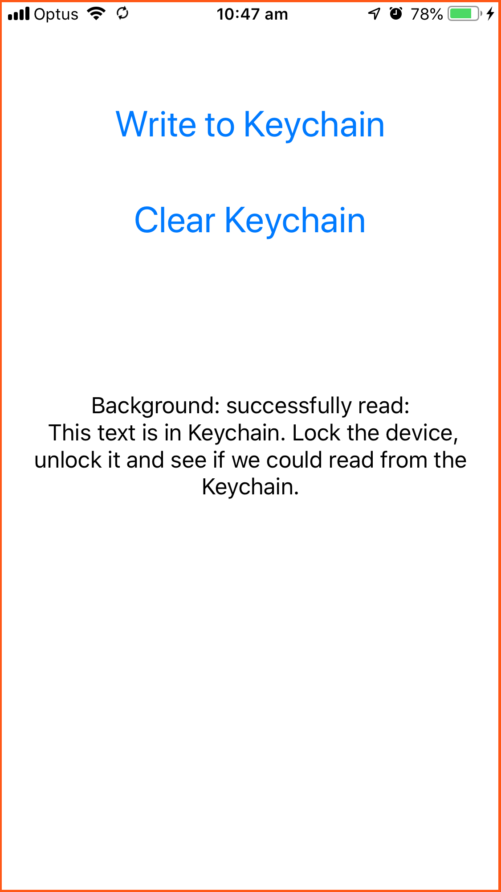

# Reading from Keychain in the background

This is an iOS demo app that checks if it's required to set access access level (`kSecAttrAccessible`) when **reading** from keychain.

Here is how it works:

- First, we write to Keychain with `accessibleAfterFirstUnlock`.

- Then we lock the device.

- While in the background, the app reads from Keychain and updates a label on screen.

- We Unlock the device and check if that read was successful.

See the following [discussion](https://github.com/evgenyneu/keychain-swift/pull/123) for more info.

## How to use

### 1. Download this repository and run the app on your device

```
https://github.com/evgenyneu/background-keychain.git
```




### 2. Click "Write to Keychain button"



### 3. Lock your device and then unlock it

After entering the background the app will read from the keychain and update a label on screen. After unlocking, you will see if that background read was successful.

